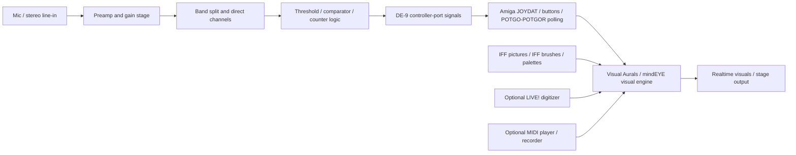
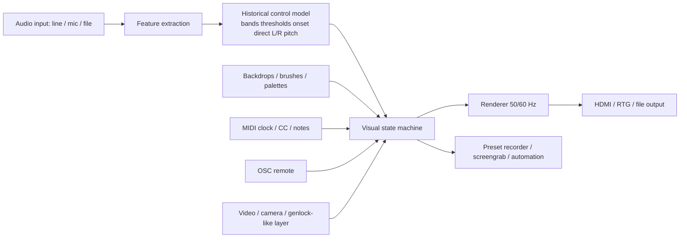

# MindLight 7 and mindEYE on the Amiga

## Executive summary

MindLight 7 was an Amiga sound-to-visualization system built around an external controller-port device plus software called **Visual Aurals**. The earliest substantiated lineage trace appears in early 1987, when contemporary press described a related **Sound Analyzer / Music Analysis System** from Visual Aural Animation(s): it attached to an Amiga controller port, accepted microphone and stereo line input, split incoming audio into multiple frequency-related channels, and bundled both analysis tools and the Visual Aurals animation package. By 1988, the system was being reviewed in Amiga magazines under the **Visual Aurals / MindLight 7** name, and by 1989–1990 it was being cataloged as a commercial graphics/audio product with **Visual Aurals I v1.77**, the **MARS I** developer source kit, a stand, oscilloscope/frequency-counter tools, IFF image/brush support, MIDI playback/recording, and integration with A-Squared’s **LIVE!** video hardware. citeturn32view0turn35search0turn31search2turn31search10turn45view0turn39search1turn38search3

The later **mindEYE** was a genuine successor rather than merely a rename. Contemporary 1996–1997 coverage describes it as a Geodesic Designs relaunch “based on the old MindLight,” still using a controller-port hardware unit plus audio input, but now explicitly supporting **all Amigas**, with later software adding **256-color AGA support**, a stronger concept of autonomous “**Evolve**” mode, “**Ensembles**” for constraining the randomizer, freeze-to-screengrab behavior, public-performance lockout, and a planned **ARexx** control path from a second Amiga. Coverage also documents conflicting price points: a **$595 list price** in 1996 launch coverage, a **$195 upgrade** for MindLight owners, and a later **$275** show/review price, which likely reflects a show special or later street price rather than a contradiction in the core product identity. citeturn44search15turn50view0turn49search14turn40search0turn40search1turn41search2

The strongest technical clue to the original hardware is the 1987 description of the front end as producing **six frequency channels, two direct channels, and a frequency counter**, combined with the Amiga controller port’s limited digital/button/pot I/O. That evidence strongly suggests an **analog filter/comparator front end** with thresholded or time-encoded outputs delivered over DE-9 controller-port lines, rather than any kind of sampled-audio stream or host-side FFT. The official Amiga hardware documentation matters here because it shows that pins **1–4 and 6** provide standard digital/button-style input, while pins **5 and 9** are not only pot inputs but can also be repurposed as **general-purpose bidirectional I/O** via **POTGO/POTGOR**, giving exactly the sort of extra signaling room a device like MindLight would have needed. citeturn32view0turn46search4turn48search0turn48search6turn48search14turn48search19

For reverse engineering, the highest-value missing artifacts are not the magazine reviews but the vendor’s own software and developer material: **Visual Aurals I v1.77**, **MARS I**, and **mindEYE 2.70/2.70g**. Publicly indexed download links did not surface in the accessible sources I reviewed, but multiple forum and Usenet traces confirm that private copies survived, old forum uploads existed, and at least one “very old Visual Aurals” build was reportedly uploaded to EAB’s **The Zone**. That means a modern reimplementation is very feasible, but an **exact** protocol clone still depends on either recovering those disks or instrumenting surviving hardware. citeturn18view1turn49search0turn49search3turn19search1turn21search3

## Evidence base and release timeline

The source base is unusually fragmented. I did **not** locate a public scan of the original full MindLight 7 manual in indexed, directly retrievable form, and I did **not** verify a currently public ADF/IMG download. What *is* available is still enough to reconstruct the product line with fairly high confidence because the topic is unusually well covered by contemporaneous buyer’s guides, launch/write-up coverage, preserved reviews, community hardware databases, and Usenet/forum preservation chatter. The table below summarizes the most useful evidence classes.

| Evidence class | Main sources | What they establish |
|---|---|---|
| Earliest near-primary product descriptions | Commodore Magazine, February 1987; Amazing Computing trade-show note, April 1987. citeturn32view0turn35search0 | A precursor/early bundle from Visual Aural Animation(s) existed by early 1987; hardware took mic + stereo line input, produced multi-band/frequency-derived data, and shipped with Visual Aurals plus analysis tools. |
| First named MindLight/Visual Aurals magazine traces | Amazing Computing Vol. 3 No. 2 (Feb 1988) contents; Amiga World Issue 17 (Feb 1988) reviews index. citeturn31search2turn31search10turn31search14 | By early 1988, the system was known in magazine coverage as MindLight / Visual Aurals. |
| First-generation catalog and buyer’s-guide evidence | AC’s Guide to the Amiga Fall ’89; AC’s Guide Winter/Fall 1990; Amiga World Video & Animation Special 1990. citeturn45view0turn44search9turn17search15turn39search1 | Visual Aurals I v1.77, MARS I, stand accessory, MIDI, IFF compatibility, oscilloscope/frequency counter, LIVE! support, and first-generation price points. |
| Primaryish user reports and support evidence | Usenet posts from 1988 and 1991. citeturn18view0turn18view1 | Real-world boot/hang issue, confirmation of v1.77 in the field, and confirmation that Visual Aural Animation had gone out of business by 1991. |
| Relaunch-era coverage for the successor | Amiga Computing Oct 1996; Amiga Format Oct 1996; Amiga Monitor/Anthony Becker’s capsule and full review. citeturn44search15turn50view0turn40search0turn40search1 | mindEYE was a Geodesic Designs relaunch based on MindLight; list price, upgrade offer, demo availability, AGA 256-color support, Evolve/Ensembles, and intense keyboard-centric workflow. |
| Preservation and scarcity evidence | EAB, Amiga.org, Google Groups, VCFed, Big Book of Amiga Hardware. citeturn21search1turn21search3turn49search0turn49search3turn24search0turn28image2 | Surviving hardware exists; manuals and disks persisted in private hands; old software uploads existed in forums; public preservation is incomplete. |
| User-supplied modern demo transcript | `/Users/manne990/Downloads/amiga-oddware-from-1987-mindlight-7-concert-music-visualizer.txt` | Secondary, non-manual evidence: a working demo reportedly used original Visual Aurals software **v1.73**, external microphone input, hard-drive or floppy execution, movable saved settings on floppy, Genlock/camera/VCR/DVD workflows, and the same palette/brush/fader/drop-screen vocabulary seen in other sources. |

### Release timeline

| Date | Event | Evidence |
|---|---|---|
| Early 1987 | A Visual Aural Animation(s) package described as the **Sound Analyzer** is documented: controller-port hardware, built-in mic, stereo line input, six frequency channels, two direct channels, frequency counter to 20 kHz, and bundled Visual Aurals. citeturn32view0 | Near-primary product listing in Commodore Magazine. |
| Spring 1987 | Amazing Computing notes a **Music Analysis System**, a small hardware box with real-time animation software from the same company. citeturn35search0 | Trade-show style product note; likely the same lineage. |
| Feb 1988 | **Mindlight 7** appears in Amazing Computing issue contents; **Visual Aurals** appears in Amiga World’s reviews list for the same period. citeturn31search2turn31search10 | Establishes commercial/review identity by early 1988. |
| 1989 | AC’s Guide lists **Visual Aurals I v1.77**, **MARS I**, **MindLight Stand**, and other add-ons from Visual Aural Animation. citeturn45view0 | Confirms first-generation software/accessory ecosystem. |
| 1990 | Amiga World buyer’s guide describes MindLight 7 as a real-time animated-graphics system from audio input, with oscilloscope, frequency counter, and MIDI player/recorder compatible with Dr. T’s products. citeturn17search15turn39search1 | Best compact contemporary feature synopsis. |
| 1991 | A user reports Visual Aural Animation has gone out of business and asks for the most recent software beyond **v1.77** and for **MARS I** source. citeturn18view1 | Documents business discontinuity and surviving version numbers. |
| 1996 | Geodesic Designs announces **mindEYE**, explicitly “based on the MindLight,” with launch coverage mentioning a downloadable demo and a **$595** list price plus a **$195** upgrade for MindLight users. citeturn44search15turn49search14turn50view0 | Commercial relaunch. |
| 1996–1997 | Review coverage documents **mindEYE 2.70 / 2.70g**, keyboard-heavy control, **Evolve**, **Ensembles**, freeze-to-disk workflow, public lockout, and later **256-color AGA** support; one source quotes **$275**. citeturn40search0turn40search1turn41search0turn41search2 | Operational details of the successor. |
| 1998 | CU Amiga still casually recommends hooking up a **MindEye** to a spare Amiga for “endless interactive eye candy,” showing it remained known in the ecosystem. citeturn22search2 | Later cultural persistence. |

## Feature and hardware reconstruction

### MindLight 7 and mindEYE compared

| Aspect | MindLight 7 | mindEYE | Sources |
|---|---|---|---|
| Vendor | Visual Aural Animation / Visual Aural Animations (name varies in contemporary sources). | Geodesic Designs. | citeturn32view0turn45view0turn44search15turn40search1 |
| Era | Commercially visible by 1988; cataloged in 1989–1990. | Relaunched in 1996; reviewed in 1996–1997. | citeturn31search2turn31search10turn44search15turn40search1 |
| Connection to Amiga | Controller port, often described generically as joystick/mouse port. | Controller port via supplied cable to the box. | citeturn26search5turn30search8turn40search1 |
| Audio input | Built-in microphone; mini-jack in later surviving descriptions; earliest lineage text refers to stereo RCA line inputs. | Built-in microphone plus 3.5 mm stereo line input. | citeturn32view0turn26search5turn40search1 |
| Front-end controls | Contemporary 1987 lineage description gives five controls: mic gain, left/right line gain, bass gain, treble gain. Surviving MindLight 7 photos also show multiple exposed adjustment wheels. | Two documented knobs: gain and threshold; two status LEDs for bass/treble. | citeturn32view0turn40search1 |
| Software name | Visual Aurals / Visual Aurals I. | mindEYE 2.70 / 2.70g. | citeturn45view0turn40search0turn40search1 |
| Base visual feature set | Audio-reactive visuals, IFF pictures/brushes, palettes, cycling, faders, scrolling, MIDI, LIVE! support. | Same foundation, plus documented Evolve/Ensembles workflow and later AGA 256-color support. | citeturn38search3turn38search6turn28image2turn40search0turn40search1 |
| Compatibility | Essentially any classic Amiga with controller port; Real-world reports center on A500/A1000/A1200 era. | Explicitly all Amigas; reviewer says latest software supports OCS/ECS/AGA, but not his 512 KB A1000. | citeturn26search5turn22search0turn40search1 |
| Pricing documented | Commonly listed around **$198** in 1990 buyer’s guides. | **$595 list**, **$195 upgrade**, later **$275** show/review price. | citeturn17search15turn44search15turn49search14turn41search0turn41search2 |
| Accessories / developer ecosystem | MARS I source kit, stand, board-art photoplotter driver, more software “coming soon.” | Demo version on website; tutorial video planned; ARexx control path planned. | citeturn45view0turn50view0turn40search1turn22search0 |

### Hardware signals and protocol envelope

The Amiga controller-port documentation is essential because it constrains what MindLight/mindEYE could realistically have sent to the host. The table below separates what is **documented** from what is **inferred**.

| Port resource | Official Amiga meaning | Why it matters for MindLight/mindEYE | Reverse-engineering implication |
|---|---|---|---|
| Pins 1–4 | Standard digital directional inputs read through **JOY0/1DAT**. citeturn46search4 | These provide four instantly readable digital lines. | Candidate lines for band-threshold or multiplex select/status signaling. |
| Pin 6 | Fire / left mouse button input. citeturn46search4 | Fifth immediately readable digital line. | Likely usable as another threshold/channel indicator. |
| Pin 5 | **POTX**, also documented in controller-port tables as one of the extra button/pot lines; can be repurposed through POTGO/POTGOR. citeturn48search0turn48search14turn48search19 | Crucial extra channel beyond normal joystick signals. | Likely used either as analog/timing input or GPIO for device-specific data. |
| Pin 9 | **POTY** / right mouse button line; likewise repurposable via POTGO/POTGOR. citeturn48search0turn48search14turn48search19 | Gives one more nonstandard channel. | Strong candidate for frequency/timing or extra status data. |
| Pins 5 and 9 together | Official docs say the pot pins can function as a **four-bit bidirectional I/O port** via POTGO/POTGOR. citeturn48search6turn48search14 | This is the single most important official clue for a custom peripheral like MindLight. | Suggests the device may have used non-joystick-style signaling on those lines. |
| Pin 7 | +5 V power, limited current budget. citeturn46search4 | Confirms the device was low-power and likely built from analog ICs + simple logic rather than anything video-heavy. | Power-budget constraints argue against onboard frame memory or a substantial processor. |
| Pins 7 / 8 | +5 V and Ground. citeturn46search4 | Standard peripheral power. | Important for safe clone design and probing. |
| Audio path | MindLight lineage docs describe mic + stereo line input, multi-band split, direct channels, and frequency counter behavior. citeturn32view0turn17search15 | Strongly implies analog preprocessing in the external box. | The original logic almost certainly was *not* raw audio streaming to the Amiga. |

Taken together, the 1987 feature description and the controller-port limits point to a very specific class of design: **audio entered the box, got preamplified and split into band-limited channels, then got thresholded and/or time-encoded into controller-port-readable events**. That fits the stated “six frequency channels, two direct channels, and a ninth frequency-counter channel” far better than any “software-only FFT” hypothesis. The software toolkit listing reinforces that view because it says source code was provided to read the **sound data produced by the MindLight** rather than to sample audio directly via a digitizer. citeturn32view0turn13search9turn15search3

*Photo-based note from the supplied images:* the first-generation MindLight 7 enclosure clearly exposes an electret microphone, a mini-jack input, a DE-9 plug, and three large exposed adjustment wheels. The visible board population looks like through-hole analog parts plus multiple small DIP packages, with no obvious large CPU or framebuffer component. That physical evidence is consistent with the analog-front-end hypothesis above.

### Likely original signal path

The following diagram is partly documented and partly inferred from the documented channel count and port constraints.

## Software behavior and UX

### Documented software UI, options, and visual logic

| Area | First-generation MindLight / Visual Aurals | mindEYE | Sources |
|---|---|---|---|
| Visual count | **84 visuals** in one contemporary description. citeturn38search0turn39search0 | Review does not quote a count, but describes “many different visuals.” | citeturn40search0turn40search1 |
| Core response model | Music affects **color, movement, object shapes, and patterns**. | Same idea, described as “visuals” triggered by bass/treble and other sensitivity settings. | citeturn38search3turn44search9turn40search1 |
| Media integration | Supports **IFF-standard pictures and brushes**; can combine with any IFF picture in any resolution or any IFF brush. | Includes background pictures, brushes, and palette shaping. | citeturn38search0turn38search3turn40search0turn40search1 |
| Measurement tools | Includes **oscilloscope** and **frequency counter**. | Also includes scope-like adjustment support in software. | citeturn17search15turn40search1 |
| MIDI | MIDI player/recorder; compatible with **Dr. T’s** products. | Review coverage still treats MIDI-style performance control as part of the family feature set. | citeturn17search15turn39search1turn28image2 |
| LIVE! support | Can combine with A-Squared **LIVE!**. | Explicitly documented in review. | citeturn38search3turn38search6turn40search0 |
| Palettes and cycling | Multiple color palettes and color cycling. | Explicit palette changes and color cycling. | citeturn28image2turn40search0 |
| Structural modifiers | Faders, scrolling, bit-splitting, fade layers, sprites, backdrops, blankers, drop screens. | Faders, visuals, blankers, scrolling, color cycling, backdrops, brushes. | citeturn28image2turn40search1 |
| Autonomous/random mode | Not clearly named in first-gen public descriptions. | **Evolve** mode randomly changes visuals and modifiers. | citeturn22search0turn40search1 |
| Constrained random mode | Not clearly documented publicly. | **Ensembles** limits what Evolve may select. | citeturn22search0turn40search1 |
| Freeze for capture | Not documented in the older catalog blurbs I found. | Space bar freezes the screen so a screengrabber can save interesting frames. | citeturn26search3turn40search1 |
| Built-in help / tutorials | Publicly preserved documentation not found. | Manual reportedly contains **five tutorials**, plus built-in help showing keyboard modifiers. | citeturn22search0turn40search1 |
| Keyboard lockout for public shows | Implied by stage/performance positioning. | Explicitly documented for unattended/public use. | citeturn40search0turn40search1 |
| AGA color depth | First-generation sources focus on classic Amiga modes. | Later software adds **256-color AGA** support. | citeturn40search0 |

### Known bugs, limitations, and workflow pain points

| Issue | Product | Evidence | Engineering significance |
|---|---|---|---|
| Boot/hang behavior at startup if the software thinks gain is too low; repeated retries needed. | MindLight 7 | A 1988 owner reports the program often opens a requestor asking him to turn up gain and then hangs. citeturn18view0 | Implies a fragile startup calibration handshake between hardware threshold and software expectations. |
| Very steep learning curve; many options accessible only from keyboard. | mindEYE | Full review says it is hard to use because of extensive keyboard support and limited GUI coverage. citeturn22search0turn40search1 | Any modern reimplementation should preserve the keyboard performance workflow while improving discoverability. |
| Poor palette requester in high resolution. | mindEYE | Explicitly criticized in review. citeturn22search0 | Suggests original UI was older, low-res-centric, and partially retrofitted for later systems. |
| Evolve mode is too random unless constrained by Ensembles. | mindEYE | Explicit review criticism. citeturn22search0 | Preset logic should separate randomness from curated setlists. |
| Slowdowns occur when the Amiga has to fetch from internal hard drive. | mindEYE | Documented in review ratings text. citeturn40search1 | Renderer is realtime but still I/O-sensitive; preload assets in any faithful remake. |
| 512 KB A1000 was inadequate in at least one reviewer’s setup. | mindEYE | Reviewer notes it “only would not run” on his 512 KB Amiga 1000. citeturn22search0 | Use 1 MB+ as practical minimum in emulation or recreation. |
| Preservation gap: manuals and disks survive mainly in private hands/forum uploads. | Both | Multiple posts ask for software/manuals; old floppy failures are reported; old Visual Aurals reportedly uploaded only to EAB’s Zone. citeturn19search1turn21search3turn49search0turn49search3 | Software recovery is the gating factor for exact preservation. |

### Installation, stage usage, MIDI, and genlock notes

| Topic | Documented behavior | Sources |
|---|---|---|
| Connection to Amiga | Plug the box into the controller port; contemporary texts alternately say “joystick port,” “mouse/joystick port,” or “second mouse port.” | citeturn26search5turn30search8turn32view0 |
| Audio hookup | Use built-in microphone or feed external audio into line input. | citeturn26search5turn30search8turn40search1 |
| Hard-drive install | mindEYE review instructs copying the **eyedir** directory from floppy to hard drive, or running directly from floppy. | citeturn40search1 |
| First-generation floppy/hard-drive workflow | A user-supplied demo transcript says Visual Aurals **v1.73** was run from a backup and could be used from floppy or hard drive; it also says live-set users could save settings on floppies, move them around, and back them up. | User-supplied transcript, not independently verified. |
| Front-end calibration | Turn up gain until LEDs flash; use the scope for finer sensitivity adjustment. | citeturn40search1 |
| External microphone workflow | The same demo transcript describes using an external microphone close to the stereo source instead of relying on the built-in microphone. | User-supplied transcript, not independently verified. |
| MIDI | Buyer’s guides explicitly document MIDI player/recorder behavior and Dr. T’s compatibility. | citeturn17search15turn39search1 |
| LIVE! / digitizer usage | Product guides and reviews state it can combine with **LIVE!** from A-Squared. | citeturn38search3turn38search6turn40search0 |
| Genlock workflows | Secondary documentation says the best effects come when combined with a **genlock**, especially camera-feedback loops. The user-supplied demo transcript adds practical examples: camera pointed at the Amiga screen, live footage, and VCR/DVD video sources routed through Genlock. | citeturn43search1turn28image2 plus user-supplied transcript. |
| Public/performance use | mindEYE review explicitly frames it as suited to clubs, concerts, and videos; lockout mode prevents user interference. | citeturn40search0turn40search1 |
| Recommended machine profile | Any Amiga works in principle; accelerator, AGA machine, and hard drive recommended for better experience. | citeturn40search1 |

### Disk images and provenance

| Artifact | Version / note | Provenance seen in public sources | Current public status in reviewed sources |
|---|---|---|---|
| Visual Aurals I | **v1.77** explicitly mentioned in 1991 Usenet inquiry. | Existing owner sought newer versions and **MARS I** in 1991. citeturn18view1 | Version confirmed to have existed; no directly retrievable public image verified here. |
| Visual Aurals / MindLight demo software | **v1.73** mentioned in a user-supplied modern demo transcript. | The demo transcript says original software version 1.73 was used from a backup. | Secondary evidence for an earlier surviving build; not independently verified. |
| Visual Aurals / MindLight 7 original floppies | Unspecified original owner disks. | 2005 request for replacement software from an owner who lost disks; 2013 owner says all floppies had long since died. citeturn19search1turn21search3 | Preservation clearly incomplete. |
| mindEYE software disk | Unspecified version. | EAB post says a user bought a MindEye on eBay and, *if the disk was good*, would post contents in **The Zone**. citeturn49search0 | Indicates a private/closed-forum preservation path, not a public indexed file. |
| Visual Aurals older build | “Very old” Visual Aurals. | EAB clone thread says the very old Visual Aurals **has been uploaded to the Zone**, while the poster is still seeking the most recent version. citeturn49search3 | Strongest public hint of an extant software archive, but not publicly indexed. |
| mindEYE demo | Downloadable demo existed on the official website in 1996 coverage. | Amiga Format launch coverage mentions a downloadable demo on the vendor’s website. citeturn50view0 | Historical evidence of distribution; no preserved downloadable file found in reviewed indexed sources. |
| mindEYE review disk | **2.70 / 2.70g** evaluation versions. | Reviewer states he received an evaluation unit and the new version 2.70g for review. citeturn40search0turn40search1 | Historically existed; no public image verified here. |
| MARS I developer kit | Source code package for MindLight developers. | Listed in 1989 vendor catalog and referenced again in 1991 Usenet request. citeturn45view0turn18view1 | Highest-value missing artifact for protocol reconstruction. |

## Reverse engineering and reimplementation spec

### What to dump, read, and measure first

The shortest path to a faithful recreation is not “guess the visuals from scratch,” but “recover the software and the bus behavior.” The priority order below reflects that.

| Priority | Task | Why it comes first | Deliverable |
|---|---|---|---|
| Highest | Acquire and image all surviving disks: **Visual Aurals I v1.77**, any earlier/later MindLight disks, **mindEYE 2.70/2.70g**, any demo disk, and especially **MARS I**. | Software and source kit are the best possible protocol documentation. | KryoFlux/Greaseweazle dumps, hashes, filesystem images, clean ADF/raw flux archives. |
| Highest | Scan manuals, tutorial sheets, labels, and box inserts at archival quality. | The public manual gap is the biggest current documentation hole. | PDF scans plus OCR text. |
| Highest | Photograph hardware front/back *without the acrylic lid glare* and record all chip markings and PCB revision text. | The visible component population likely reveals whether the device is filter/comparator logic, latch/counter logic, or contains an MCU/PLD. | Annotated board map and BOM candidate list. |
| High | Buzz out the DE-9 connector to every IC pin. | This identifies whether audio-derived outputs land on digital lines, pot lines, or both. | Netlist: DE-9 pin → device nodes. |
| High | Drive the audio input with sine sweeps, stereo pulses, and broadband noise while probing all DE-9 lines. | This reconstructs the actual signaling protocol empirically. | Frequency response map and pin activity matrix. |
| High | Trace knob behavior against pin behavior. | Needed to understand gain/threshold calibration and startup quirks. | Calibration curves and startup behavior notes. |
| High | Static-analyze the binaries for reads of **JOYxDAT**, **CIAAPRA**, **POTGOR**, and timing loops. | Tells you which exact port resources the software expects. | Symbol/commented disassembly and register-access map. |
| Medium | Extract help text, keyboard tables, preset names, and file formats from the binaries/disks. | This reconstructs the original UI vocabulary. | Keyboard map, preset schema, asset loader notes. |
| Medium | Compare first-generation MindLight hardware to mindEYE hardware one-for-one. | Determines what changed between versions and which behaviors were preserved in software. | Delta report: analog front-end, controls, signaling, software assumptions. |

### Minimal hypothesis for the original hardware logic

Based on the 1987 multi-channel description and the Amiga port capabilities, the most likely first-pass hypothesis is:

- Stage one: microphone / line-input preamp with user-adjustable gain.
- Stage two: a fixed analog filter bank, probably centered on a handful of low/mid/high bands plus direct L/R passthrough envelope detection.
- Stage three: comparators or Schmitt-trigger logic converting each envelope into digital assertions or pulses.
- Stage four: simple glue logic, counters, or multiplexing to fit more channel state onto the DE-9 controller-port lines.
- Stage five: Amiga software polls port registers at frame rate or faster and uses those states to drive the visual engine.

That hypothesis fits the public descriptions much better than a sampled-audio design, and it also matches the visible simplicity of surviving hardware boards. citeturn32view0turn46search4turn48search6turn13search9

### Specification for a modern reimplementation

The table below is a **recommended modern spec**, not a historical claim. It is designed to preserve behavior documented for MindLight/mindEYE while giving you a clean development target.

| Subsystem | Recommended design |
|---|---|
| Audio inputs | Stereo line-in, mono fallback, optional built-in mic path, selectable input source. |
| Analysis model | 6 historical-style energy bands plus optional higher-resolution FFT internally; expose **Bass**, **Treble**, **Mid**, **Left Direct**, **Right Direct**, **Onset**, **Global Energy**, and **Pitch/Frequency estimate**. |
| Calibration | Per-input gain, threshold, noise floor, attack/release, hysteresis, stereo width, and AGC toggle. |
| Visual engine | Discrete “visuals” plus modifiers: faders, blankers, scroll modes, palette cycling, sprite layer, backdrop layer, brush layer, drop-screen behavior, bit-splitter, fade layers. |
| Autonomous modes | **Evolve** mode that randomizes from an allowed pool; **Ensemble** objects that constrain which visuals/modifiers/backgrounds may be used. |
| Asset support | IFF ILBM import, PNG/JPEG fallback, brush sets, backdrop sets, palette presets, optional ANIM5 and modern sequence import. |
| Capture | Freeze current frame, save screenshot, record preset state, optionally record parameter stream for later playback. |
| Timing | Analysis hop 5–10 ms; visual-state commit at 50/60 Hz; optional quantization to musical BPM or MIDI clock. |
| MIDI | MIDI clock in/out, note/CC mapping for scene changes, palette changes, evolve toggle, freeze, gain/threshold adjustments, visual selection. |
| OSC | Optional OSC mirror of all mutable parameters for remote control and multi-machine rigs. |
| Video integration | Optional live camera/video input layer to emulate historical genlock/LIVE! workflows; alpha/matte and feedback modes. |
| Performance mode | Mouse hidden, keyboard-only control, lockout mode, auto-start into selected preset/ensemble. |
| Preset format | Human-readable JSON or YAML containing all visual/modifier selections, analysis settings, asset references, and MIDI/OSC mappings. |

### Suggested architecture for a faithful reimplementation

### Recommended implementation paths

| Path | Best use case | Advantages | Trade-offs |
|---|---|---|---|
| Native reimplementation on a modernized A1200-class system | You want a machine that “feels Amiga” on real output hardware. | Best stage experience; easiest to target RTG/fullscreen output; easiest to combine with modern audio interfaces. | Requires choosing an actual runtime/toolkit for your specific A1200NG stack. |
| **Amiberry plugin + virtual controller-port device** | You want the most historically faithful *system model* and perhaps to test against recovered original binaries if disks are found. | Lets you emulate controller-port electrical behavior and later compare with original software expectations. | Highest engineering overhead; only really pays off once disk images or protocol traces exist. |
| Standalone Linux/SDL/OpenGL app | Fastest route to a working modern clone. | Easiest audio/video/MIDI integration; easiest preset management; easiest distribution. | Least “hardware-authentic” unless you deliberately mimic the original keyboard flow and frame timing. |

My practical recommendation is:

- Build the **standalone/Linux/SDL** renderer first.
- Keep the analysis/control layer abstract so it can later accept:
  - direct host audio,
  - a recovered **MindLight protocol decoder**, or
  - a virtual **Amiberry controller-port** device.
- Add an **Amiberry bridge** only after you either recover **MARS I** or scope a real hardware unit.

That sequencing gets you useful output early without blocking on archival luck.

## Open questions and limitations

The biggest remaining gaps are archival, not conceptual. I did not verify a public original manual scan, and I did not verify a directly downloadable public disk image for either MindLight 7 or mindEYE from the sources reviewed. Public traces strongly imply that surviving copies exist in private hands and closed forum archives, but not yet in a stable, indexed preservation location. citeturn49search0turn49search3turn21search1turn21search3

Some early nomenclature is also messy. The 1987 sources speak of **Sound Analyzer** and **Music Analysis System**, while later sources speak of **MindLight 7** and **Visual Aurals**. The evidence strongly suggests a single product lineage, but without the vendor manual or source kit it is safer to treat the early 1987 name as a **precursor/early branding phase** rather than assume perfect one-to-one identity. citeturn32view0turn35search0turn31search2

Finally, the exact controller-port protocol remains unproven. The official Amiga documentation makes the signaling *space* clear, and the historical product descriptions make the device class clear, but only three things can settle the remaining uncertainty: a surviving developer source kit, a software disassembly, or oscilloscope traces from a working unit. Until one of those appears, the hardware logic above should be treated as a high-confidence engineering inference rather than a finished schematic. citeturn46search4turn48search6turn18view1turn45view0
